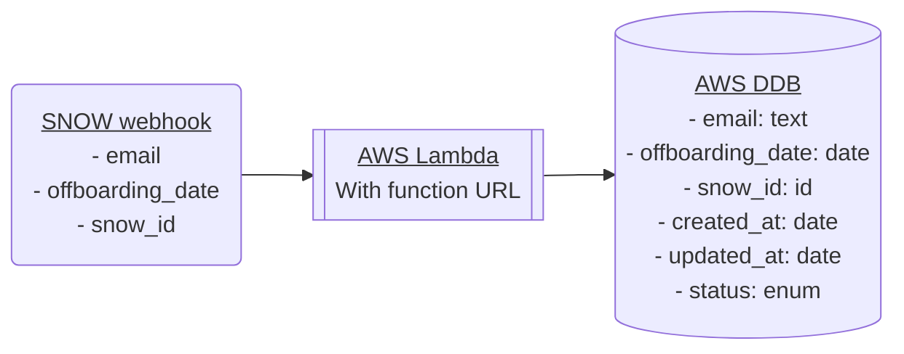
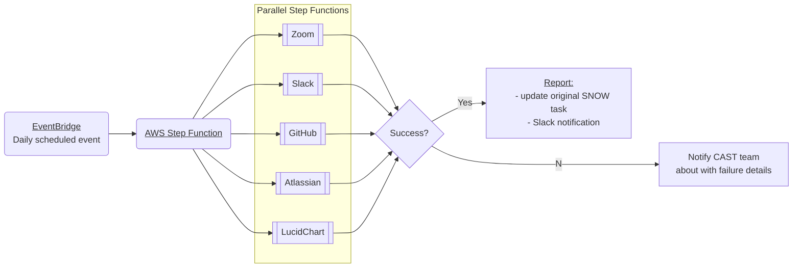

# Offboarding Automation

This project automates the removal of users from our services as part of the
offboarding process.

Useful links

- Confluence doc:
  https://ac3-wiki.atlassian.net/wiki/spaces/CAST/pages/4040458353/Offboarding+Automation+WIP
- Temporary repo: https://github.com/atenni/offboarding-automation

TODOs

- [x] Push to personal GitHub repo
- [ ] Bootstrap CDK into sandbox acct (profile: TEMP-personalAwsAcct)
  - _Obviously this should just be infra-as-code and not include anything AC3
    specific._
- [x] Set up prettier
- [ ] CI/CD tests and code quality
- [ ] CI/CD deployment
- [ ] Implement [Lambda PowerTools]
- [ ] Write helper functions for DDB queries
- [ ] Write quick dev helper script to populate/reset local DDB with sample data
- [ ] Write tests for all functions
- [ ] Report on test coverage
- [ ] ~Write tests for all CDK stacks?
- [ ] Set up sample events for local dev
- [ ] Set up `npm run` scripts for local dev (lambda, DDB, and step functions)
- [ ] Make doco great (keep in sync with [Confluence doc])
- [ ] Add repo badges

[Lambda PowerTools]:
  https://awslabs.github.io/aws-lambda-powertools-typescript/latest/
[Confluence doc]:
  https://ac3-wiki.atlassian.net/wiki/spaces/CAST/pages/4040458353/Offboarding+Automation+WIP

Useful commands

- `npm run build` compile typescript to js
- `npm run watch` watch for changes and compile
- `npm run test` perform the jest unit tests
- `cdk deploy` deploy this stack to your default AWS account/region
- `cdk diff` compare deployed stack with current state
- `cdk synth` emits the synthesized CloudFormation template

---

- [Architecture](#architecture)
  - [Queue offboarding stack](#queue-offboarding-stack)
  - [Process offboarding stack](#process-offboarding-stack)

---

# Architecture

At a high level this project consists of two decoupled processes that are
implemented as two CDK stacks:

1. Queuing a user for offboarding – `QueueOffboardingStack`
2. Processing the offboarding task at a later date - `ProcessOffboardingStack`

## Queue offboarding stack

CDK stack name: `QueueOffboardingStack`

Possible values for DDB `status` enum:

- `QUEUED`
- `IN_PROGRESS`
- `ERROR`
- `SUCCESS`

## Process offboarding stack

CDK stack name: `ProcessOffboardingStack`

**Note** – each parrallel step function will need to:

1. Query for the user by supplied email address
2. Deactivate user
3. Revoke andy access tokens
