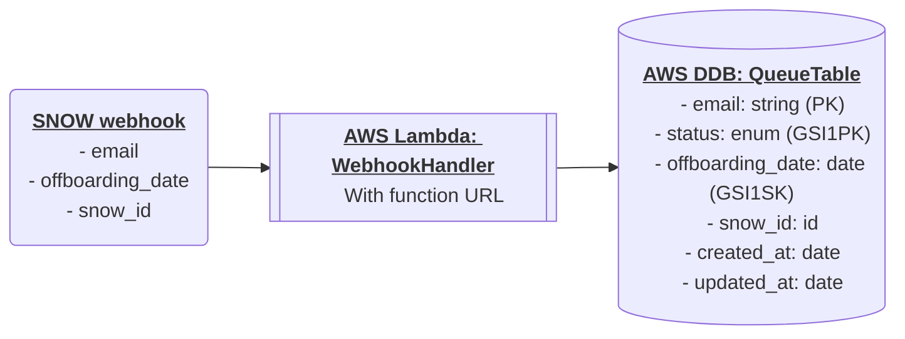
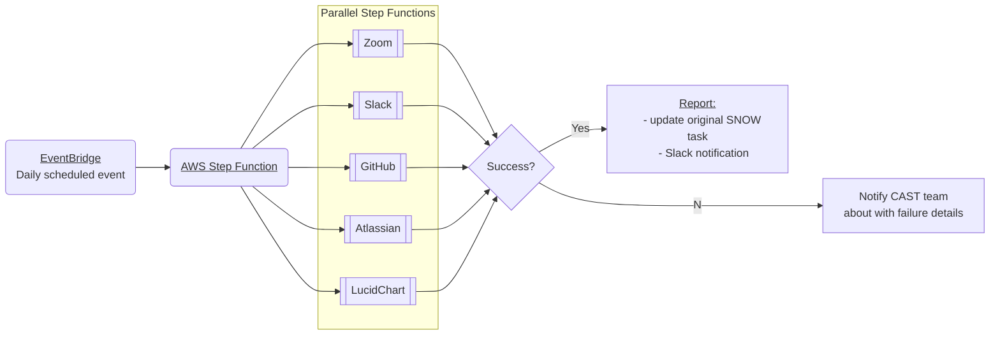

# Offboarding Automation

This project automates the removal of users from our services as part of the
offboarding process.

Useful links

- Confluence doc:
  https://ac3-wiki.atlassian.net/wiki/spaces/CAST/pages/4040458353/Offboarding+Automation+WIP
- Temporary repo: https://github.com/atenni/offboarding-automation

TODOs

- [x] Update personal AWS IAM acct to use new custom role defined
      [here][custom-role]. Currently it has admin.
- [x] Push to personal GitHub repo
- [x] Bootstrap CDK into sandbox acct (profile: TEMP-personalAwsAcct)
  - _Obviously this should just be infra-as-code and not include anything AC3
    specific._
- [x] Set up prettier
- [x] Build `QueueOffboardingStack` (simple)
- [ ] Build `ProcessOffboardingStack` (more complex)
- [ ] CI/CD tests and code quality
- [ ] CI/CD deployment
- [ ] Implement [Lambda PowerTools]
- [x] Write helper functions for DDB queries
- [ ] Write quick dev helper script to populate/reset local DDB with sample data
- [ ] Write tests for all functions
- [ ] Report on test coverage
- [ ] ~Write tests for all CDK stacks?
- [ ] Set up sample events for local dev
- [ ] Set up `npm run` scripts for local dev (lambda, DDB, and step functions)
- [ ] Make doco great (keep in sync with [Confluence doc])
- [ ] Add repo badges
- [x] Tag all constructs. What tags will we use? (ie. team:cas,
      repo:github.com/{}...}, env:prod, service:offboarding-automation, etc.)
- [ ] Make service connectors reusable? (ie. Atlassian, Zoom, etc step
      functions)

[custom-role]:
  https://docs.aws.amazon.com/cdk/v2/guide/getting_started.html#getting_started_prerequisites
[Lambda PowerTools]:
  https://awslabs.github.io/aws-lambda-powertools-typescript/latest/
[Confluence doc]:
  https://ac3-wiki.atlassian.net/wiki/spaces/CAST/pages/4040458353/Offboarding+Automation+WIP

Useful commands

- `npm run build` compile typescript to js
- `npm run watch` watch for changes and compile
- `npm run test` perform the jest unit tests
- `cdk deploy` deploy this stack to your default AWS account/region
- `cdk diff` compare deployed stack with current state
- `cdk synth` emits the synthesized CloudFormation template

---

- [Architecture](#architecture)
  - [Queue offboarding stack](#queue-offboarding-stack)
  - [Process offboarding stack](#process-offboarding-stack)
- [Environment variables](#environment-variables)
- [Code style](#code-style)

---

# Architecture

At a high level this project consists of two decoupled processes that are
implemented as two CDK stacks:

1. Queuing a user for offboarding – `QueueOffboardingStack`
2. Processing the offboarding task at a later date - `ProcessOffboardingStack`

## Queue offboarding stack

CDK stack name: `QueueOffboardingStack`

### DDB design - access patterns, keys and indexes

The table needs to support two primary access patterns:

1. Get _a single item_ by email address for updating the offboarding_date
2. Get _all items_ with a status of `QUEUED` for a given date / date range (or
   any other valid status)

To support this we'll use a global secondary index (GSI).

- **PK (partition key):** email address to be offboarded
  - Format: string - `anne@email.com`
  - It would be an error to ever have more than one record with the same email.
    Having a PK without an SK enforces this[^1]
- **GSI1PK (global secondary index #1 partition key):** status
  - Possible values: `QUEUED` |`IN_PROGRESS` | `ERROR` | `SUCCESS`
- **GSI1SK (global secondary index #1 sort key):** offboarding_date
  - Format: `YYYY-MM-DD`
  - GSI-PK / GSI-SK combinations are allowed to be non-unique. This will allow
    us to have different users with the same status (`QUEUED`) and offboarding
    dates, which is desirable.

[^1]:
    GSI-PK / GSI-SK combinations are allowed to be non-unique. However, PK / SK
    combinations on the main table are not.

This primary key design allows the following queries to be made efficiently:

- Individual user by email _(PK = email address)_
- All `QUEUED` tasks _(GSI1PK = QUEUED)_
- All `QUEUED` tasks where `offboarding_date` is today _(GSI1PK = QUEUED &
  GSI1SK = `2023-03-01`)_
- All `QUEUED` tasks where `offboarding_date` is this month _(GSI1PK = QUEUED &
  GSI1SK begins with `2023-03`)_
- All `QUEUED` tasks where `offboarding_date` is in the past _(GSI1PK = QUEUED &
  GSI1SK < `2023-03-01`)_

## Process offboarding stack

CDK stack name: `ProcessOffboardingStack`

**Note** – each parallel step function will need to:

1. Query for the user by supplied email address
2. Deactivate user
3. Revoke andy access tokens

**Desirable feature:** each service connector (Atlassian, Zoom, etc) should be
designed to be reusable by other projects.

# Environment variables

This project uses [dotenv] to manage environment variables.

> **Note**  
> You will need to create a `.env` file in the root of this project, or set the
> required environment variables another way.

This should not be checked into version control.

See [.env.template] file for required values and documentation.

[.env.template]: /.env.template
[dotenv]: https://github.com/motdotla/dotenv

# Code style

This project uses [Prettier] to ensure a consistent code style.

[Prettier]: https://prettier.io/
